# Execution Plan

## Detailed Analysis Summary

### Change Impact Assessment
- **User-facing changes**: Yes — 전체 시스템이 새로 구축됨 (프론트엔드 + 백엔드 + DB)
- **Structural changes**: Yes — 새로운 시스템 아키텍처 설계 필요
- **Data model changes**: Yes — MongoDB 컬렉션 설계 (리소스, 사용자, 이력, 감사 로그)
- **API changes**: Yes — 전체 REST API 설계 필요
- **NFR impact**: Yes — 보안(bcrypt, 세션, 계정 잠금), 성능(10~50 사용자), Docker 배포

### Risk Assessment
- **Risk Level**: Medium
- **Rollback Complexity**: Easy (Greenfield - 기존 시스템 영향 없음)
- **Testing Complexity**: Moderate (다중 모듈, 권한 체계, 유사도 알고리즘)

---

## Workflow Visualization

```mermaid
flowchart TD
    Start(["User Request"])
    
    subgraph INCEPTION["🔵 INCEPTION PHASE"]
        WD["Workspace Detection<br/><b>COMPLETED</b>"]
        RA["Requirements Analysis<br/><b>COMPLETED</b>"]
        US["User Stories<br/><b>COMPLETED</b>"]
        WP["Workflow Planning<br/><b>COMPLETED</b>"]
        AD["Application Design<br/><b>EXECUTE</b>"]
        UG["Units Generation<br/><b>EXECUTE</b>"]
    end
    
    subgraph CONSTRUCTION["🟢 CONSTRUCTION PHASE"]
        FD["Functional Design<br/><b>EXECUTE</b>"]
        NFRA["NFR Requirements<br/><b>EXECUTE</b>"]
        NFRD["NFR Design<br/><b>EXECUTE</b>"]
        ID["Infrastructure Design<br/><b>EXECUTE</b>"]
        CG["Code Generation<br/><b>EXECUTE</b>"]
        BT["Build and Test<br/><b>EXECUTE</b>"]
    end
    
    Start --> WD
    WD --> RA
    RA --> US
    US --> WP
    WP --> AD
    AD --> UG
    UG --> FD
    FD --> NFRA
    NFRA --> NFRD
    NFRD --> ID
    ID --> CG
    CG --> BT
    BT --> End(["Complete"])
    
    style WD fill:#4CAF50,stroke:#1B5E20,stroke-width:3px,color:#fff
    style RA fill:#4CAF50,stroke:#1B5E20,stroke-width:3px,color:#fff
    style US fill:#4CAF50,stroke:#1B5E20,stroke-width:3px,color:#fff
    style WP fill:#4CAF50,stroke:#1B5E20,stroke-width:3px,color:#fff
    style AD fill:#FFA726,stroke:#E65100,stroke-width:3px,stroke-dasharray: 5 5,color:#000
    style UG fill:#FFA726,stroke:#E65100,stroke-width:3px,stroke-dasharray: 5 5,color:#000
    style FD fill:#FFA726,stroke:#E65100,stroke-width:3px,stroke-dasharray: 5 5,color:#000
    style NFRA fill:#FFA726,stroke:#E65100,stroke-width:3px,stroke-dasharray: 5 5,color:#000
    style NFRD fill:#FFA726,stroke:#E65100,stroke-width:3px,stroke-dasharray: 5 5,color:#000
    style ID fill:#FFA726,stroke:#E65100,stroke-width:3px,stroke-dasharray: 5 5,color:#000
    style CG fill:#4CAF50,stroke:#1B5E20,stroke-width:3px,color:#fff
    style BT fill:#4CAF50,stroke:#1B5E20,stroke-width:3px,color:#fff
    style INCEPTION fill:#BBDEFB,stroke:#1565C0,stroke-width:3px,color:#000
    style CONSTRUCTION fill:#C8E6C9,stroke:#2E7D32,stroke-width:3px,color:#000
    style Start fill:#CE93D8,stroke:#6A1B9A,stroke-width:3px,color:#000
    style End fill:#CE93D8,stroke:#6A1B9A,stroke-width:3px,color:#000
    
    linkStyle default stroke:#333,stroke-width:2px
```



### Text Alternative
```
Phase 1: INCEPTION
- Workspace Detection (COMPLETED)
- Requirements Analysis (COMPLETED)
- User Stories (COMPLETED)
- Workflow Planning (COMPLETED)
- Application Design (EXECUTE)
- Units Generation (EXECUTE)

Phase 2: CONSTRUCTION
- Functional Design (EXECUTE, per-unit)
- NFR Requirements (EXECUTE, per-unit)
- NFR Design (EXECUTE, per-unit)
- Infrastructure Design (EXECUTE, per-unit)
- Code Generation (EXECUTE, per-unit)
- Build and Test (EXECUTE)
```

---

## Phases to Execute

### 🔵 INCEPTION PHASE
- [x] Workspace Detection (COMPLETED)
- [x] Requirements Analysis (COMPLETED)
- [x] User Stories (COMPLETED)
- [x] Workflow Planning (IN PROGRESS)
- [ ] Application Design - **EXECUTE**
  - **Rationale**: 신규 시스템으로 컴포넌트 식별, 서비스 레이어 설계, 컴포넌트 메서드 및 비즈니스 규칙 정의 필요
- [ ] Units Generation - **EXECUTE**
  - **Rationale**: 다중 모듈 시스템 (인증, 리소스 관리, IMPORT/EXPORT, 이력, 배포), 구조화된 분해 필요

### 🟢 CONSTRUCTION PHASE (Per-Unit)
- [ ] Functional Design - **EXECUTE**
  - **Rationale**: 새 데이터 모델(MongoDB 컬렉션), 복잡한 비즈니스 로직(유사도 탐지, 권한 체계, Soft Delete 정책)
- [ ] NFR Requirements - **EXECUTE**
  - **Rationale**: 보안(bcrypt, 세션 30분, 3회 잠금), Docker 배포, PBT 프레임워크 선정(jqwik/fast-check)
- [ ] NFR Design - **EXECUTE**
  - **Rationale**: NFR 패턴(세션 관리, 계정 잠금, 이력 보존 정책) 설계 필요
- [ ] Infrastructure Design - **EXECUTE**
  - **Rationale**: Docker 컨테이너 구성, MongoDB 설정, 서비스 간 네트워킹
- [ ] Code Generation - **EXECUTE** (ALWAYS)
  - **Rationale**: 전체 코드 구현
- [ ] Build and Test - **EXECUTE** (ALWAYS)
  - **Rationale**: 빌드 및 종합 테스트

### 🟡 OPERATIONS PHASE
- [ ] Operations - **PLACEHOLDER**
  - **Rationale**: 향후 배포/모니터링 워크플로우 확장 예정

---

## Skipped Stages
- Reverse Engineering — **SKIP** (Greenfield 프로젝트, 기존 코드 없음)

---

## Success Criteria
- **Primary Goal**: 사내 개발 리소스(메시지 키, 기능 ID, 메뉴 ID) 통합 관리 시스템 MVP 구현
- **Key Deliverables**:
  - React + Tailwind 프론트엔드 (인증, 리소스 관리, IMPORT/EXPORT, 배포, 이력 화면)
  - Spring Boot 백엔드 REST API
  - MongoDB 데이터 레이어
  - Docker Compose 기반 배포 설정
  - PBT 포함 테스트 스위트
- **Quality Gates**:
  - 모든 User Stories의 Acceptance Criteria 충족
  - PBT 규칙(PBT-01~10) 준수
  - 4단계 권한 체계 동작 검증
  - 중복 확인 + 유사 제안 워크플로우 동작 검증
