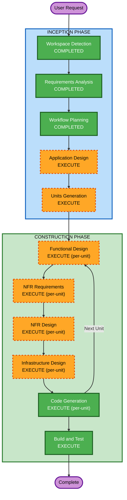

# Execution Plan

## Detailed Analysis Summary

### Change Impact Assessment
- **User-facing changes**: Yes - 완전히 새로운 웹 애플리케이션 구축
- **Structural changes**: Yes - 전체 시스템 아키텍처 신규 설계
- **Data model changes**: Yes - SQLite 스키마 신규 설계 (사용자, 리소스 3종, 변경 이력, 버전 태그)
- **API changes**: Yes - REST API 전체 신규 설계
- **NFR impact**: Yes - 보안(JWT, RBAC, rate limiting), 성능(가상 스크롤), 배포(Docker Compose)

### Risk Assessment
- **Risk Level**: Medium
- **Rollback Complexity**: Easy (Greenfield, 기존 시스템 없음)
- **Testing Complexity**: Moderate (다양한 기능 + 보안/PBT 확장 규칙 적용)

## Workflow Visualization



### Text Alternative
```
Phase 1: INCEPTION
- Workspace Detection (COMPLETED)
- Requirements Analysis (COMPLETED)
- User Stories (SKIPPED)
- Workflow Planning (COMPLETED)
- Application Design (EXECUTE)
- Units Generation (EXECUTE)

Phase 2: CONSTRUCTION (per-unit loop)
- Functional Design (EXECUTE, per-unit)
- NFR Requirements (EXECUTE, per-unit)
- NFR Design (EXECUTE, per-unit)
- Infrastructure Design (EXECUTE, per-unit)
- Code Generation (EXECUTE, per-unit)
- Build and Test (EXECUTE, after all units)
```

## Phases to Execute

### INCEPTION PHASE
- [x] Workspace Detection (COMPLETED)
- [x] Requirements Analysis (COMPLETED)
- [x] User Stories (SKIPPED)
  - **Rationale**: 사용자 유형이 단순 (관리자/일반 사용자), 요구사항이 충분히 구체적, 사용자가 skip 선택
- [x] Workflow Planning (COMPLETED)
- [ ] Application Design - EXECUTE
  - **Rationale**: 새 시스템의 컴포넌트 식별, 서비스 레이어 설계, API 구조 정의 필요
- [ ] Units Generation - EXECUTE
  - **Rationale**: 복잡한 시스템으로 다중 유닛 분해 필요 (인증, 리소스 관리, 버전 관리, Import/Export 등)

### CONSTRUCTION PHASE
- [ ] Functional Design - EXECUTE (per-unit)
  - **Rationale**: 각 유닛별 비즈니스 로직 상세 설계 필요 (자동 계산 필드, 버전 관리 로직, import/export 검증 등)
- [ ] NFR Requirements - EXECUTE (per-unit)
  - **Rationale**: Security Baseline 확장 적용, JWT 인증, rate limiting, 구조적 로깅 등 NFR 설계 필요
- [ ] NFR Design - EXECUTE (per-unit)
  - **Rationale**: NFR 패턴을 코드 구조에 반영하는 상세 설계 필요
- [ ] Infrastructure Design - EXECUTE (per-unit)
  - **Rationale**: Docker Compose 배포 아키텍처, Nginx 리버스 프록시, volume 설정 등 인프라 설계 필요
- [ ] Code Generation - EXECUTE (per-unit, ALWAYS)
  - **Rationale**: 구현 계획 및 코드 생성
- [ ] Build and Test - EXECUTE (ALWAYS)
  - **Rationale**: 빌드 지침, 단위/통합 테스트, PBT 테스트 지침 생성

### OPERATIONS PHASE
- [ ] Operations - PLACEHOLDER
  - **Rationale**: 향후 배포/모니터링 워크플로우 확장 예정

## Success Criteria
- **Primary Goal**: Google Sheets 대체 리소스 관리 웹 애플리케이션 완성
- **Key Deliverables**:
  - Spring Boot 백엔드 (JWT 인증, REST API, SQLite)
  - React TypeScript 프론트엔드 (AG Grid, 드래그앤드롭)
  - Docker Compose 배포 구성
  - 종합 테스트 (단위, 통합, PBT)
- **Quality Gates**:
  - SECURITY-01 ~ SECURITY-15 전체 준수
  - PBT-01 ~ PBT-10 전체 준수
  - 모든 CRUD 기능 동작 확인
  - Import/Export TSV 정상 동작
  - 버전 태깅 및 롤백 정상 동작
